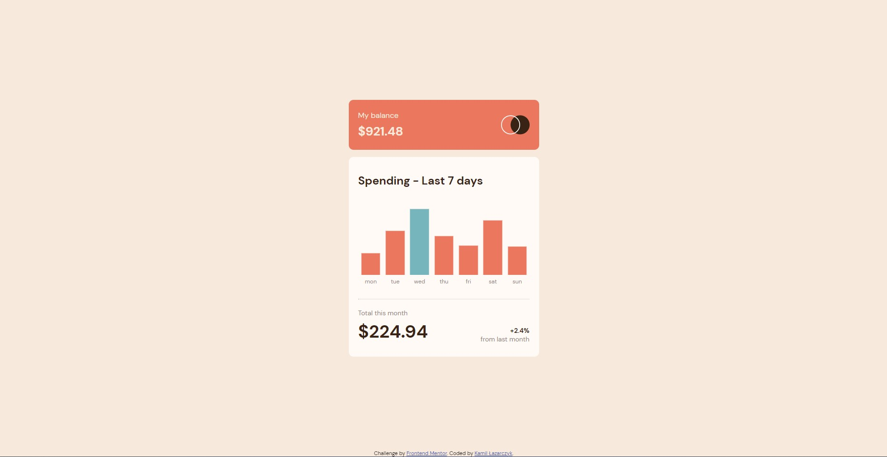

# Frontend Mentor - Expenses chart component solution

This is a solution to the [Expenses chart component challenge on Frontend Mentor](https://www.frontendmentor.io/challenges/expenses-chart-component-e7yJBUdjwt). Frontend Mentor challenges help you improve your coding skills by building realistic projects. 

## Table of contents

- [Overview](#overview)
  - [The challenge](#the-challenge)
  - [Screenshot](#screenshot)
  - [Links](#links)
- [My process](#my-process)
  - [Built with](#built-with)
  - [What I learned](#what-i-learned)
  - [Continued development](#continued-development)
  - [Useful resources](#useful-resources)
- [Author](#author)

## Overview

### The challenge

Users should be able to:

- View the bar chart and hover over the individual bars to see the correct amounts for each day
- See the current day’s bar highlighted in a different colour to the other bars
- View the optimal layout for the content depending on their device’s screen size
- See hover states for all interactive elements on the page
- **Bonus**: Use the JSON data file provided to dynamically size the bars on the chart

- I had to modify some of the website's styles due to Google Charts's limitations

### Screenshot

### Links

- [Live site URL](https://kamillazarczyk1.github.io/expenses-chart-component/)

## My process

### Built with

- Semantic HTML5 markup
- Sass
- Flexbox
- Mobile-first workflow
- JavaScript
- Fetch API
- Google Charts

### What I learned

While doing this challange I was able to try using Google Charts for the first time and also to use external JSON file for the data in the chart.

### Continued development

In my future projects I want to use new technologies to make them better

### Useful resources

- [W3Schools](https://www.w3schools.com/)
- [Google Charts Docs](https://developers.google.com/chart/interactive/docs/quick_start)
- [Stack OverFlow](https://stackoverflow.com/)

## Author

- GitHub - [KamilLazarczyk1](https://github.com/KamilLazarczyk1)
- Frontend Mentor - [@KamilLazarczyk1](https://www.frontendmentor.io/profile/KamilLazarczyk1)
